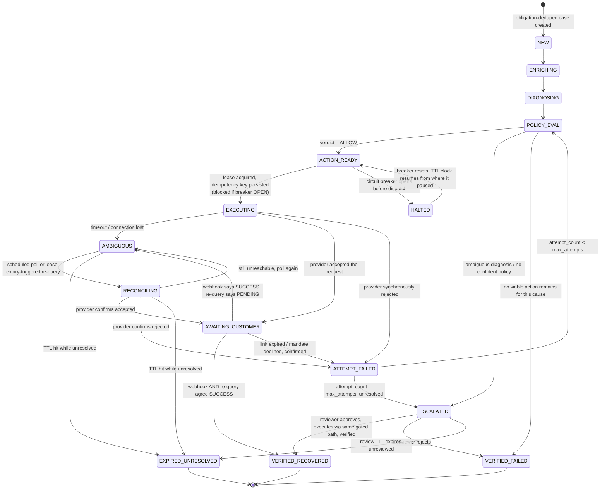

# Reclaim — Hardened Architecture

**Scope:** the identity model, concurrency model, state machine, AI/simulator boundaries, and the invariant table — hardened against the failure sequences a payments engineer would actually attack. Deliberately **not** included: System Context / Container / Component / ERD / full-sequence diagrams, and 10-column invariant tables. These document things a solo builder already holds in working memory; they don't stop a double charge. One diagram is included — the one that does.

---

## 1. Identity hierarchy

An earlier design deduped actions on `case_id`. That does not protect what the identity rule is actually for — one recovery per underlying failed payment. Deduping cases on `payment_id` is an improvement, but still wrong: `payment_id` isn't stable. Every attempt against the same obligation (the customer's own retry, our `retry_charge`, a second authorization attempt) gets its own `payment_id`. Deduping on it lets each new attempt slip in as a "new" obligation.

The actual hierarchy:

```
Financial Obligation   — the thing owed. Anchor: order_id (one-time payments)
                          or (subscription_id, billing_cycle_id) (recurring).
                          Stable across every attempt made against it.
        ↓
Recovery Case           — our unit of work. ONE per Financial Obligation,
                          enforced by a unique constraint on the obligation
                          anchor — not on payment_id, not on case_id.
        ↓
Recovery Action         — the chosen intervention (retry_charge /
                          create_payment_link / escalate) for this case at
                          a point in time. A case can have several over its
                          life (first link expires → second action).
        ↓
Execution Attempt       — one concrete try at that action. Retries of the
                          SAME attempt reuse its idempotency key; a NEW
                          action gets a new one.
        ↓
Provider Request        — the actual HTTP call, carrying the persisted key
                          / reference_id.
```

Case creation: extract the obligation anchor from the webhook payload regardless of event type — `payment.failed` and `subscription.charge.failed` for the same underlying charge must resolve to the same anchor — then `INSERT ... ON CONFLICT (obligation_anchor) DO NOTHING` (or `DO UPDATE SET last_seen_at = now()`). A redelivered webhook, or a second event type for the same failure, becomes a no-op at this layer. It never reaches a worker.

---

## 2. Idempotency, precisely

Don't equate `UNIQUE(case_id, action_type)` with idempotency — it conflates "the same logical attempt happening twice" with "a legitimate second attempt," and blocks the second when the case genuinely needs one (first link expired, unclaimed).

- Idempotency key is generated and persisted **inside the execution_attempt row's own insert transaction**, before any network call.
- A retry of a **failed/ambiguous network call for the same attempt** reuses that key.
- A **new attempt** (a new Recovery Action — e.g. action #2 after #1 expired) gets a freshly generated key, tied to the new execution_attempt row.
- For `create_payment_link`: bind the key into Razorpay's `reference_id` field. Razorpay rejects a second Payment Link created against a `reference_id` already in use, returning an explicit duplicate error rather than silently creating a second link (confirmed against Razorpay's documentation). So on restart-after-crash, retry the create with the same `reference_id`: success means the first attempt never landed; the duplicate error means fetch-by-reference_id and adopt the existing link. That's a real algorithm, not "reconciliation" as an unexplained black box.
- For `retry_charge`: verify whatever endpoint this actually maps to (subscription charge retry vs. a fresh order) has an equivalent binding key before locking this in. **Requires verification** — not treated as architectural fact until it's checked, per the standard this document is trying to hold itself to.

---

## 3. Unknown outcomes are a state, not an inference

A timeout is not a failure. Modeled explicitly:

```
ACTION_READY → EXECUTING → { AMBIGUOUS | AWAITING_CUSTOMER | ATTEMPT_FAILED }
AMBIGUOUS → RECONCILING → { AWAITING_CUSTOMER | ATTEMPT_FAILED | AMBIGUOUS (poll again) }
```

`AMBIGUOUS` is entered on: connection drop, provider timeout, or a contradiction between signals (webhook says SUCCESS, re-query says PENDING). It is **never** auto-resolved to failure, and no new execution attempt may be dispatched for a case sitting in `AMBIGUOUS` or `RECONCILING` — reconciliation and a fresh dispatch are mutually exclusive on the same case, guarded the same atomic way as every other transition.

If TTL expires while the case's last resolved state was `AMBIGUOUS`/`RECONCILING`, it goes to **`EXPIRED_UNRESOLVED`** — a distinct terminal state from `VERIFIED_FAILED`. This matters for the dashboard: an unresolved case is not a confirmed loss and isn't a win either. It gets its own bucket, flagged for manual reconciliation, excluded from the lift calculation until resolved.

If TTL expires **before** the case ever reached `EXECUTING` (stuck in diagnosis during a total LLM outage, say), it routes to `ESCALATED`, not `EXPIRED_UNRESOLVED` — no money action was ever attempted, so there's nothing ambiguous, just unprocessed, and a human can still act on it.

### Authoritative state machine



Note what's absent on purpose: there's no edge from `AMBIGUOUS` or `RECONCILING` straight to a new `EXECUTING`. That edge is the double-charge bug. It doesn't exist because it's never drawn. `ATTEMPT_FAILED` is a routing state, not a resting one — it deterministically sends the case back to `POLICY_EVAL` for another action if budget remains, or to `ESCALATED` if it doesn't. That's what makes "a case can have several actions over its life" true without ever risking two live actions at once.

---

## 4. Concurrency: leases, not held locks — with fencing

Don't hold `SELECT ... FOR UPDATE SKIP LOCKED` across an LLM call or a provider call. Claim with a short transaction, do the slow work with nothing held, write back with a second short transaction:

```sql
UPDATE cases SET worker_id = $1, lease_expires_at = now() + interval '90s',
                  fencing_token = fencing_token + 1
WHERE id = $2 AND state = $3 AND lease_expires_at < now()
RETURNING fencing_token;
```

The returned `fencing_token` travels with the worker for the life of that claim. On write-back:

```sql
UPDATE cases SET state = $new_state, ...
WHERE id = $2 AND fencing_token = $observed_token;
```

Zero rows updated means another worker already reclaimed this case — the current worker's result is stale and must be **discarded**, not retried. This is the actual answer to "a worker hangs and comes back late": it doesn't need to be dead for the system to stay safe, it just needs to lose the race, and the fencing token is what makes losing the race cheap and detectable instead of a silent overwrite.

A sweeper reclaims any row where `lease_expires_at < now()`, independent of whether the worker that held it ever comes back. That's the difference between this and "reconciliation on worker startup" — the latter only helps a worker that restarts. A worker that hangs forever needs someone *else* to notice.

---

## 5. Attempt taxonomy and retry amplification

| Layer | Counts against `max_attempts`? | Bound |
|---|---|---|
| Webhook redelivery | No — absorbed at obligation-dedup, never reaches a worker | Provider's own retry schedule |
| LLM invocation / formatting retry | No | 1 retry, then deterministic fallback |
| Policy evaluation | No | N/A — pure function |
| Reconciliation poll | No | Bounded by case TTL, fixed interval, not proportional to webhook volume |
| Notification (SMS/email) send | No — own small bounded retry | 3 tries, doesn't restart the case |
| **Financial recovery action / execution attempt** | **Yes** | `attempt_count <= max_attempts` |

Only the last row moves money. This is the fix for "an Ollama JSON hiccup silently burns your case's attempt budget," which was the sharpest gap in the previous version.

Amplification stays bounded because none of these multiply against each other: a flurry of webhook redeliveries produces one case (dedup layer), a flurry of LLM retries produces one diagnosis (capped ladder), and reconciliation runs on its own clock rather than in proportion to inbound traffic.

---

## 6. Circuit breaker × TTL

`HALTED` pauses the TTL clock — tracked as accumulated non-halted wall-clock time, not a fixed deadline, so a case is neither penalized for a pause it didn't cause nor granted an unbounded extension.

Breaker scope: **one global breaker**, kept deliberately simple for a solo 10-day build. Real cost: a spike on one payment method halts recovery for every case, including healthy ones on unrelated methods. Logged with the triggering cause/method breakdown so the tradeoff is visible in the audit trail rather than hidden. Listed below as an accepted risk, not silently absorbed.

---

## 7. AI boundary

- Response schema: closed enums for action and cause, plus a free-text `reasoning` field that touches no execution path. **No field can hold a monetary amount, a payment/customer identifier, or a destination.** Amount, IDs, and destinations are always copied by non-LLM code from trusted rows. This makes the unsafe output structurally impossible to route into an effect, not merely disallowed by convention.
- Untrusted text (customer notes, provider free-text error strings) enters the prompt as clearly delimited data, never concatenated as instruction. The schema constraint above is the real backstop — even a successful injection has nowhere to go, since nothing in the response schema can *do* anything except select from a fixed enum.
- Confidence: don't gate policy on the model's self-reported number — an uncalibrated 0.94 isn't evidence of anything. Gate on a **deterministic ambiguity signal** instead: no lookup-table match *and* conflicting history signals (a recent success and a recent failure both on file) defines "ambiguous," independent of what the model claims about itself. Log the model's confidence for observability only; it has zero authority over routing.
- LLM unavailable/degraded: the provider's failure code is mapped to a cause by a fixed lookup table, an unrecognised code becoming `UNKNOWN`, and the policy table then selects the action for that cause exactly as it would for a model-supplied one. This is the direct answer to "what happens if the AI disappears" — nothing stops, and nothing downstream can tell the difference.

---

## 8. Verification — the exact ladder

| Term | Means |
|---|---|
| Action dispatched | Provider request sent, idempotency key persisted |
| Request accepted | Provider synchronously acknowledged (link created / retry scheduled) |
| Payment successful | Webhook says so — **alone, insufficient** |
| Payment verified | Webhook **and** an independent provider re-query agree |
| Revenue recovered | Verified, **and** written to `recovered_amount` by the Verifier only — no other code path may write this column |

Contradictory signals (webhook SUCCESS, re-query PENDING) → `AMBIGUOUS`, resolved by re-polling, never resolved in the optimistic direction by default.

Monetary values throughout: integer minor units (paise), never floating point.

---

## 9. Simulator independence

The circularity risk is real if the simulated outcome is a function of anything the *agent itself* produced — its confidence, its reasoning. The fix: the simulator's resolution probability is a function of **(a)** case features known before the agent acts, and **(b)** which of the three fixed action types fired — with per-action-type rates as separate, cited, externally-sourced parameters, layered on top of the shared organic-recovery baseline that applies identically to both arms. Never a function of the agent's confidence score or free-text reasoning. Confidence gates nothing, including the simulator.

Sample size is n = 50 per arm, and the per-action rates must be externally sourced and cited rather than assumed — an uncited rate makes every number downstream of it look evidence-based while being invented.

---

## 10. Human review — the whole lifecycle, not a box

`ESCALATED` → reviewer sees the case with its diagnosis and evidence → **approve** (executes the recommended or reviewer-chosen action through the *same* policy-gated, idempotent executor path — a human clicking approve is not a side door around the invariants above) → **reject** (`VERIFIED_FAILED`) → **expire** (a longer but still bounded review TTL; unreviewed at expiry → `EXPIRED_UNRESOLVED`, flagged, never silently dropped).

---

## 11. Loopholes closed

1. **Two live recovery mechanisms racing.** A case tries `retry_charge`, it appears to fail/timeout so the system falls back to `create_payment_link` — but the original retry actually settles later. Customer is charged twice through two individually-idempotent, individually-correct actions. Fix: block a new action while any prior action on the case is unresolved; if a new action is genuinely warranted (prior one expired, not ambiguous), explicitly supersede it — void/cancel the prior mechanism as part of creating the new one. Never let two live payment paths coexist.
2. **Stale worker overwrites newer state.** Covered in §4 — fencing tokens. Without them, a slow (not dead) worker can write after another worker has already completed the case, silently clobbering a correct result with a stale one.
3. **Reconciliation racing a fresh dispatch.** A scheduled re-query and a new execution attempt could both target the same case if the state guard isn't atomic. Closed by the diagram in §3 — reconciliation and dispatch are mutually exclusive states, enforced by the same compare-and-swap pattern as every other transition, not a special case.
4. **Global breaker hides which cause tripped it.** Addressed in §6 — logged with cause/method breakdown, scoping deferred as an accepted risk rather than silently absorbed or over-engineered away.
5. **Escalation as an unaudited side channel.** Addressed in §10 — approval routes through the same executor, same idempotency, same audit transaction as an automated action.

---

## 12. Accepted risks

| Risk | Why it exists | Prototype mitigation | Production fix |
|---|---|---|---|
| Global, not scoped, circuit breaker | Scoping is real engineering time for marginal buildathon value | Trip logged with cause/method breakdown | Per-method or per-cause breaker scoping |
| Single shared human-reviewer credential | No RBAC needed to demonstrate the lifecycle | Action attributable via audit log, not login | Per-reviewer identity + permissions |
| Fixed-interval reconciliation polling | Adaptive backoff unneeded at demo data volume | Interval sized to TTL and case volume | Adaptive/backoff polling, provider push where available |
| LLM confidence unused for safety | Not calibrated or validated in 10 days | Logged for observability only | Calibration study before using it to gate anything |
| Dual-action supersede handled for the common case | Exhaustive interleaving coverage is a large surface | Block-then-supersede as in item 1 of §11 | Formal proof or exhaustive interleaving tests |

---

## 13. Architecture contract

1. A Recovery Case's identity is bound to the obligation anchor (order or subscription-cycle id) — never to `payment_id`, never to `case_id`, never to a webhook event id. Case creation is idempotent on that anchor.
2. No Execution Attempt reaches the provider without a persisted idempotency key or reference_id, written in the same transaction as the attempt row, before the network call.
3. An unknown provider outcome transitions to `AMBIGUOUS`. It never auto-resolves to failure, and never permits a new execution attempt on the same case while unresolved.
4. A case cannot have two execution attempts, or an execution attempt and a reconciliation attempt, in flight at once.
5. No field in the LLM's response schema can populate a monetary amount, an identifier, or a destination.
6. Revenue counts as recovered only after independent verification; dispatch alone never increments `recovered_amount`.
7. A case whose TTL expires while unresolved is `EXPIRED_UNRESOLVED` — distinct from `VERIFIED_FAILED`, excluded from both the recovered and confirmed-lost buckets until a human resolves it.
8. Time spent `HALTED` does not count against a case's TTL.
9. A worker's write is only accepted if its fencing token matches the case's current token; a stale write is a no-op.
10. Human approval executes through the same gated, idempotent path as an automated action — no side channel moves money.
11. The simulator's outcome probability is a function of pre-decision case features and the fixed action type taken — never of the agent's own confidence or reasoning.

---

## Status

**Closed in this design:** obligation-anchor identity, ambiguous-outcome modeling, dual-action race, stale-worker fencing, reconciliation/dispatch mutual exclusion, attempt taxonomy, HALT/TTL interaction, human-review side-channel, simulator circularity.

**Still open, by design — see §12:** breaker scoping, reviewer RBAC, adaptive polling, confidence calibration, exhaustive interleaving proof.