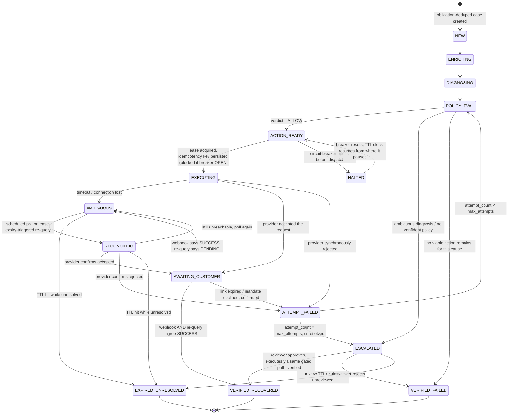

# Architecture

> Reclaim is designed so that uncertain payment outcomes cannot silently
> become unsafe financial actions.

This document covers the identity model, the state machine, concurrency,
the AI boundary, and the architecture contract those pieces exist to
satisfy. It deliberately does **not** include System Context / Container /
Component / ERD diagrams — those document things a solo builder already
holds in working memory, and they don't stop a double charge. One diagram
is included: the one that does.

---

## 1. Architecture at a glance

Every design decision below serves one rule: **an uncertain outcome must
never be resolved by guessing.** A timeout, a dropped connection, a
contradiction between two signals — none of these become a silent success
or a silent failure. They become an explicit state, sitting in the database,
waiting for either more evidence or a human.

The trust hierarchy this system enforces, strongest to weakest:

```
financial facts  >  independent verification  >  deterministic policy  >  provider claims  >  model diagnosis
```

A model's opinion never outranks a policy table. A provider's webhook never
outranks an independent re-query. Nothing outranks what's actually in the
database.

**Core mechanisms, each covered in its own section:**

| Mechanism | Closes |
|---|---|
| [Core domain model](#2-core-domain-model) | duplicate recovery workflows |
| [State machine](#3-state-machine) | guessing at uncertain outcomes |
| [Idempotency](#4-idempotency) | a crash producing a second charge |
| [Concurrency & fencing](#5-concurrency--fencing) | a stale worker silently overwriting newer state |
| [Retry & attempt boundaries](#6-retry--attempt-boundaries) | non-financial retries burning financial budget |
| [AI safety boundary](#7-ai-safety-boundary) | a model output ever moving money |
| [Verification](#8-verification) | revenue counted on unconfirmed evidence |
| [Human review](#9-human-review) | approval as a side channel around every other rule |
| [Circuit breaker & TTL](#10-circuit-breaker--ttl) | hammering a broken provider, or penalizing a case for it |

---

## 2. Core domain model

**What it is.** A four-level hierarchy, each level owning exactly one
concern:

```
Financial Obligation   the thing owed. Anchor: order_id (one-time) or
                        (subscription_id, billing_cycle_id) (recurring).
                        Stable across every attempt made against it.
        ↓
Recovery Case           our unit of work. ONE per Financial Obligation,
                        enforced by a unique constraint on the obligation
                        anchor — never on payment_id, never on case_id.
        ↓
Recovery Action         the chosen intervention (retry_charge /
                        create_payment_link / escalate) at a point in
                        time. A case can have several over its life —
                        e.g. a first link expires, a second is created —
                        but never two live at once (§3).
        ↓
Execution Attempt       one concrete try at that action. A retry of the
                        SAME attempt reuses its idempotency key; a NEW
                        action gets a new one.
```

**Why it matters.** Deduping on `case_id` protects nothing — it's downstream
of the actual problem. Deduping on `payment_id` is closer but still wrong:
every attempt against the same obligation (the customer's own retry, our
`retry_charge`, a second authorization) gets its own `payment_id`. Dedupe on
that and each new attempt slips in as a "new" obligation — the exact bug
this hierarchy exists to prevent.

**How Reclaim handles it.** The obligation anchor is extracted from the
webhook payload regardless of event type — `payment.failed` and
`subscription.charge.failed` for the same underlying charge resolve to the
same anchor — then inserted with `ON CONFLICT (obligation_anchor) DO
NOTHING`. A redelivered webhook, or a second event type for the same
failure, becomes a no-op at this layer. It never reaches a worker.

When a case genuinely needs a second action (its first expired, unclaimed),
the new action supersedes the prior one explicitly rather than the two
coexisting — never two live financial mechanisms on one case at once.

---

## 3. State machine

**What it is.** An explicit state for every outcome a provider interaction
can produce — including "unknown."

**Why it matters.** A network timeout is not a failure. Treat it as one and
a payment that actually succeeded gets abandoned, or worse, retried into a
double charge. Most of the bugs a payments engineer would look for live in
the gap between "the request might have failed" and "the request definitely
failed."

**How Reclaim handles it.** `AMBIGUOUS` is a first-class state, entered on a
connection drop, a provider timeout, or a contradiction between signals (a
webhook says `SUCCESS`, a re-query says `PENDING`). It is never
auto-resolved to failure, and while a case sits in `AMBIGUOUS` or
`RECONCILING`, no new execution attempt may be dispatched for it.



**What's deliberately absent:** there's no edge from `AMBIGUOUS` or
`RECONCILING` straight to a new `EXECUTING`. That edge is the double-charge
bug — it doesn't exist because it's never drawn.

`ATTEMPT_FAILED` is a routing state, not a resting one: it deterministically
sends the case back to `POLICY_EVAL` for another action if budget remains,
or to `ESCALATED` if it doesn't.

If TTL expires while unresolved, the case becomes **`EXPIRED_UNRESOLVED`** —
distinct from `VERIFIED_FAILED`. It's not a confirmed loss and not a win
either, so it gets its own bucket, excluded from revenue and lift
calculations until a human resolves it. If TTL expires *before* the case
ever reached `EXECUTING` (stuck in diagnosis during a model outage, say), it
routes to `ESCALATED` instead — no money action was ever attempted, so
there's nothing ambiguous, just unprocessed.

---

## 4. Idempotency

**What it is.** A retry of the same logical financial attempt must never
create a second financial action.

**Why it matters.** A worker can crash after a provider request succeeds but
before the response is persisted. On restart, naively retrying the same
logical attempt risks a second charge for something that already happened.

**How Reclaim handles it.**

- The idempotency key is generated and persisted **inside the execution
  attempt's own insert transaction**, before any network call.
- A retry of a failed/ambiguous call **for the same attempt** reuses that
  key. A **new** attempt (action #2 after #1 expired) gets a freshly
  generated one.
- For `create_payment_link`, the key is bound into Razorpay's
  `reference_id`. Razorpay rejects a second Payment Link against a
  `reference_id` already in use with an explicit duplicate error, rather
  than silently creating a second link. So on restart-after-crash, the
  retry reuses the same `reference_id`: success means the first attempt
  never landed; a duplicate error means fetch-by-reference and **adopt**
  the existing link instead of creating a new one.

`retry_charge` is held to the same standard rather than assumed safe:
Razorpay exposes no merchant-facing charge-retry endpoint that accepts a
caller-supplied idempotency key, so policy never selects it, and the
executor refuses it before dispatch even if it somehow were — see
[docs/ROADMAP.md](ROADMAP.md) for the full provider-verification picture.

---

## 5. Concurrency & fencing

**What it is.** Workers claim a case with a short-lived lease and carry a
monotonically increasing fencing token for the life of that claim.

**Why it matters.** Holding `SELECT ... FOR UPDATE SKIP LOCKED` across an
LLM call or a provider call is exactly wrong — it turns network latency into
lock contention. But releasing the lock while the slow work happens opens a
different problem: a worker that hangs and comes back late, after someone
else has already finished the case.

**How Reclaim handles it.** Claim with a short transaction, do the slow work
with nothing held, write back with a second short transaction:

```sql
-- claim
UPDATE cases SET worker_id = $1, lease_expires_at = now() + interval '90s',
                  fencing_token = fencing_token + 1
WHERE id = $2 AND state = $3 AND lease_expires_at < now()
RETURNING fencing_token;

-- write-back, using the token observed at claim time
UPDATE cases SET state = $new_state, ...
WHERE id = $2 AND fencing_token = $observed_token;
```

Zero rows updated on write-back means another worker already reclaimed this
case. The current worker's result is **discarded**, not retried — that's the
whole answer to "a worker hangs and comes back late." It doesn't need to be
dead for the system to stay safe; it just needs to lose the race, and the
fencing token makes losing the race cheap and detectable instead of a silent
overwrite.

A **sweeper** independently reclaims any row where `lease_expires_at <
now()`, regardless of whether the original worker ever comes back — the
difference between this and "reconciliation on worker startup" is that a
worker that hangs *forever* still gets noticed by someone else.

---

## 6. Retry & attempt boundaries

**What it is.** Only one layer of retry is allowed to touch a case's
financial attempt budget.

**Why it matters.** A flaky model call, a webhook redelivery storm, or a
reconciliation poll cycle must never amplify into real charge attempts. If
every retry at every layer counted, a single flaky dependency could exhaust
a case's budget before a real attempt ever happened.

**How Reclaim handles it** — only the last row below counts against
`max_attempts`:

| Layer | Counts against budget? | Bound |
|---|---|---|
| Webhook redelivery | No — absorbed at dedup, never reaches a worker | Provider's own retry schedule |
| LLM invocation / formatting retry | No | 1 retry, then deterministic fallback |
| Policy evaluation | No — pure function | — |
| Reconciliation poll | No | Bounded by case TTL, fixed interval |
| Notification send | No — own small bounded retry | 3 tries, never restarts the case |
| **Execution attempt** | **Yes** | `attempt_count <= max_attempts` |

None of these multiply against each other: a burst of webhook redeliveries
still produces one case, a burst of LLM retries still produces one
diagnosis, and reconciliation runs on its own clock instead of in proportion
to inbound traffic.

---

## 7. AI safety boundary

**What it is.** The model diagnoses a failure cause and proposes an action.
That's the entire extent of what it can do.

**Why it matters.** A generative model is the least trustworthy input in
this system — it can hallucinate, and it processes untrusted text (customer
notes, provider error strings). If its output could reach an amount, an
identifier, or a destination, a single bad response could move money.

**How Reclaim handles it.**

- The response schema is closed: fixed enums for cause and action, plus a
  free-text `reasoning` field that touches no execution path. **No field
  can hold a monetary amount, a payment/customer identifier, or a
  destination.** Those are always copied by non-LLM code from trusted
  database rows — making unsafe output structurally impossible to route
  into an effect, not merely disallowed by convention.
- Untrusted text enters the prompt as clearly delimited data, never
  concatenated as instruction. The schema constraint above is the real
  backstop: even a successful prompt injection has nowhere to go, since
  nothing in the response schema can *do* anything except select from a
  fixed enum.
- The model's self-reported confidence has **zero authority over routing**.
  Ambiguity is instead a deterministic signal: no lookup-table match *and*
  conflicting history (a recent success and a recent failure both on file).
  Confidence is logged for observability only.
- If the model is unreachable or degraded, a fixed lookup table maps the
  provider's own failure code to a cause, and the same policy table selects
  the action exactly as it would for a model-supplied diagnosis. Nothing
  downstream can tell the difference — which is the only way to know the
  fallback is real.

---

## 8. Verification

**What it is.** A five-rung ladder between "we tried" and "we can count the
revenue."

**Why it matters.** A webhook is one party's claim about what happened, not
proof. Counting revenue on a webhook alone risks overstating recovery on a
spoofed, delayed, or simply wrong signal.

**How Reclaim handles it:**

| Rung | Means |
|---|---|
| Action dispatched | Provider request sent, idempotency key persisted |
| Request accepted | Provider synchronously acknowledged |
| Payment successful | Webhook says so — **alone, insufficient** |
| Payment verified | Webhook **and** an independent provider re-query agree |
| Revenue recovered | Verified, **and** written by the Verifier role only — no other code path can write this column |

A contradiction (webhook `SUCCESS`, re-query `PENDING`) becomes `AMBIGUOUS`
and is resolved by re-polling — never resolved optimistically by default.
Monetary values are integer minor units throughout; never floating point.

---

## 9. Human review

**What it is.** `ESCALATED` cases get a reviewer, not an unaudited manual
override.

**Why it matters.** A human "just fixing it" outside the normal path is
exactly the kind of side channel that bypasses every invariant above —
idempotency, fencing, verification — in one click.

**How Reclaim handles it.** A reviewer sees the case with its diagnosis and
evidence, then:

- **Approves** — executes the recommended or reviewer-chosen action through
  the *same* policy-gated, idempotent executor path as an automated
  recovery. Approval creates a **proposed** action and nothing else; the
  executor still performs the actual dispatch.
- **Rejects** — `VERIFIED_FAILED`.
- **Doesn't act in time** — a bounded review TTL expires the case to
  `EXPIRED_UNRESOLVED`, flagged, never silently dropped.

---

## 10. Circuit breaker & TTL

**What it is.** A global gate that halts dispatch after repeated failures,
paired with a TTL clock that only runs while a case is actually being
worked.

**Why it matters.** Continuing to hammer a broken or misconfigured provider
connection wastes attempt budget on attempts that were never going to
succeed. And a case shouldn't be penalized — have its recovery window
shrink — for a pause it didn't cause.

**How Reclaim handles it.** `HALTED` pauses the TTL clock, tracked as
accumulated non-halted wall-clock time rather than a fixed deadline, so a
case is neither penalized for a halt nor granted an unbounded extension. The
breaker itself is intentionally **one global gate**, not scoped per payment
method — a real tradeoff (a spike on one method halts recovery for
unrelated ones too), logged with the triggering cause breakdown so it's
visible rather than hidden. See [Accepted risks](#12-accepted-risks).

---

## 11. Simulator independence

**What it is.** The recovery-effectiveness simulator's outcome probability
depends only on pre-decision case features and which fixed action type
fired — never on the diagnosing model's confidence or reasoning.

**Why it matters.** If the simulated outcome were a function of anything the
agent itself produced, the evaluation would be circular: a model confident
in its own diagnosis would appear to cause better outcomes, regardless of
whether the diagnosis was right.

**How Reclaim handles it**, enforced three separate ways:

1. The simulator's own outcome table has no column for any model-generated
   value — the dependency isn't just forbidden, it's unrepresentable.
2. Feature extraction takes a case record and no database connection, so it
   physically cannot reach the diagnoses table.
3. The diagnosed cause is never read; the failure code comes from the
   original provider payload instead.

Per-action-type rates must be externally sourced and cited rather than
assumed — an uncited rate would make every downstream number look
evidence-based while being invented.

---

## 12. Accepted risks

Carried deliberately, not silently absorbed — each has a note in the audit
trail or a documented mitigation:

| Risk | Prototype mitigation | Production fix |
|---|---|---|
| Global, not per-method, circuit breaker | Trip logged with cause/method breakdown | Per-method or per-cause scoping |
| Single shared human-reviewer credential | Action attributable via audit log, not login | Per-reviewer identity + permissions |
| Fixed-interval reconciliation polling | Interval sized to TTL and case volume | Adaptive/backoff polling, provider push where available |
| Model confidence unused for safety | Logged for observability only | Calibration study before gating anything on it |
| Dual-action supersede handles the common case | Block-then-supersede (§2) | Formal proof or exhaustive interleaving tests |

---

## 13. Architecture contract

Every clause below is enforced by a specific mechanism and covered by a
specific test — see [docs/ROADMAP.md](ROADMAP.md) for what's verified.

1. A Recovery Case's identity is bound to the obligation anchor — never to
   `payment_id`, `case_id`, or a webhook event id. Case creation is
   idempotent on that anchor.
2. No Execution Attempt reaches the provider without a persisted idempotency
   key, written in the same transaction as the attempt row, before the
   network call.
3. An unknown provider outcome transitions to `AMBIGUOUS`. It never
   auto-resolves to failure, and never permits a new attempt on the same
   case while unresolved.
4. A case cannot have two execution attempts, or an execution attempt and a
   reconciliation attempt, in flight at once.
5. No field in the model's response schema can populate a monetary amount,
   an identifier, or a destination.
6. Revenue counts as recovered only after independent verification;
   dispatch alone never increments it.
7. A case whose TTL expires while unresolved is `EXPIRED_UNRESOLVED` —
   distinct from `VERIFIED_FAILED`, excluded from revenue and loss buckets
   until a human resolves it.
8. Time spent `HALTED` does not count against a case's TTL.
9. A worker's write is accepted only if its fencing token matches the
   case's current token; a stale write is a no-op.
10. Human approval executes through the same gated, idempotent path as an
    automated action — no side channel moves money.
11. The simulator's outcome probability depends on pre-decision case
    features and the action taken — never on the model's confidence or
    reasoning.

---

## 14. Current status

**Closed in this design:** obligation-anchor identity, ambiguous-outcome
modeling, the dual-action race, stale-worker fencing,
reconciliation/dispatch mutual exclusion, retry-attempt boundaries, the
HALT/TTL interaction, the human-review side channel, simulator circularity.

**Still open, by design** — see [Accepted risks](#12-accepted-risks):
breaker scoping, reviewer RBAC, adaptive polling, confidence calibration,
exhaustive interleaving proof.

For implementation status — what's built, what's provider-verified, what
remains — see [docs/ROADMAP.md](ROADMAP.md).
